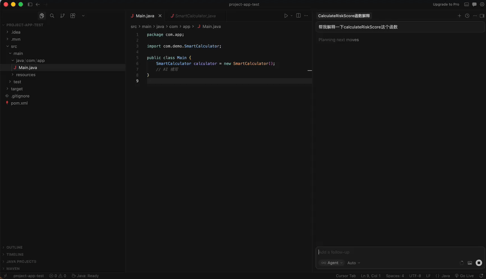

# OmniOpenAIDoc: Software Supply Chain 2.0 🚀 
[](https://opensource.org/licenses/Apache-2.0)
[](https://marketplace.visualstudio.com/items?itemName=derichuang.OmniOpenAIDoc)
[](https://central.sonatype.com/artifact/io.github.nuaahuang/omni-openai-doc-maven-plugin)


> **"Distribution is Documentation; Shipping is Semantics."** > **“发布即文档，分发即语义。”**

OmniOpenAIDoc is a semantic distribution protocol designed to eliminate **API Drift** and **AI Hallucinations** in large-scale software engineering. It ensures that AI agents (like Cursor/Claude) always reason based on the precise, version-anchored metadata of your dependencies.

---

## 🌐 Documentation & Language / 文档与语言

Please select your preferred language to view the project details and technical specifications:

### 🇺🇸 English (English)
* **Overview & Vision**: [**README_EN.md**](./README_EN.md)
* **Protocol Standard**: [**SPEC_V1_EN.md**](./omni-spec/SPEC_V1_EN.md)

### 🇨🇳 简体中文 (Simplified Chinese)
* **项目愿景与架构**: [**README_CN.md**](./README_CN.md)
* **协议技术规范**: [**SPEC_V1_CN.md**](./omni-spec/SPEC_V1_CN.md)

---

## 📂 Project Structure
* `omni-maven-plugin`: The Producer (Java/Maven) - Injects semantics into artifacts.
* `omni-vscode-extension`: The Consumer (TS/VS Code) - Synchronizes semantics for AI.
* `omni-spec/`: The Core Open-Omni Protocol definition.
* `.cursorrules`: The AI Context Injection rules for IDEs.

---

---

## ✨ The "Aha!" Moment (Why Omni?)

Traditional AI coding assistants struggle with **Binary Dependencies (JARs)**. They see decompiled code, lose Javadoc, and guess business logic. **OmniOpenAIDoc bridges this gap.**

### 🎬 Live Demonstration: Binary Logic Awakening

| ❌ Without Omni (Traditional) | ✅ With Omni (Semantic Aware) |
| :---: | :---: |
| **AI is Blinded by Decompilation** | **AI Reads the "Soul" of the JAR** |
|  |  |
| *AI doesn't know the funcion.* | *AI sees the function and know how to use the function.* |

> **Key Difference:** Look at the right panel. Notice how Cursor uses the **`@omni-temp_sources`** provided by Omni to explain the **0.85 Risk Penalty Factor** for low-asset users. **This is no hallucination; it's ground-truth semantics.**

---

## 🛠️ Quick Start

### 1. Configure the Maven Plugin
Add the following to your `pom.xml` in the Java project:

```xml
<build>
  <plugins>
    <plugin>
      <groupId>io.github.omni</groupId>
      <artifactId>omni-maven-plugin</artifactId>
      <version>1.0.0</version>
      <configuration>
        <globalOutputRelPath>.omni/manifests</globalOutputRelPath>
      </configuration>
      <executions>
        <execution>
          <id>generate-omni-manifest</id>
          <phase>compile</phase>
          <goals>
            <goal>generate</goal>
          </goals>
        </execution>
      </executions>
    </plugin>
  </plugins>
</build>
```
### 2. Generate Semantic Manifests
Run the standard build command. The plugin will scan your source code and generate version-locked `omni-manifest.json` files in the `.omni/manifests` directory.
```bash
mvn clean compile
```

### 3. Synchronize with VS Code / Cursor
Install the **OmniOpenAIDoc** extension and run the following command from the Command Palette (`Cmd+Shift+P`):

> **OmniOpenAIDoc: Sync Semantic Context**

This command will:
* **Parse**: Read the aggregated JSON manifests from `.omni/manifests/`.
* **Shadow Source**: Generate **Shadow Source Code** under `.omni/temp_sources/` to enable AI symbol jumping and context indexing.
* **AI Context**: Automatically generate or update `.cursorrules` to guide your AI agent's (Cursor/Claude) reasoning based on the latest semantics.


### 4. Git Configuration
To keep your repository clean and prevent AI shadow files from being committed, ensure the `.omni` directory is ignored in your `.gitignore`:

```text
# OmniOpenAIDoc Generated Content
.omni/
```

---

## ⚖️ License & Author
**Author:** Deric Huang  
**License:** [Apache License 2.0](https://www.apache.org/licenses/LICENSE-2.0)  

---
> **"Stop letting binary packages be the graveyards of semantics; let AI read the code that is no longer there."**

